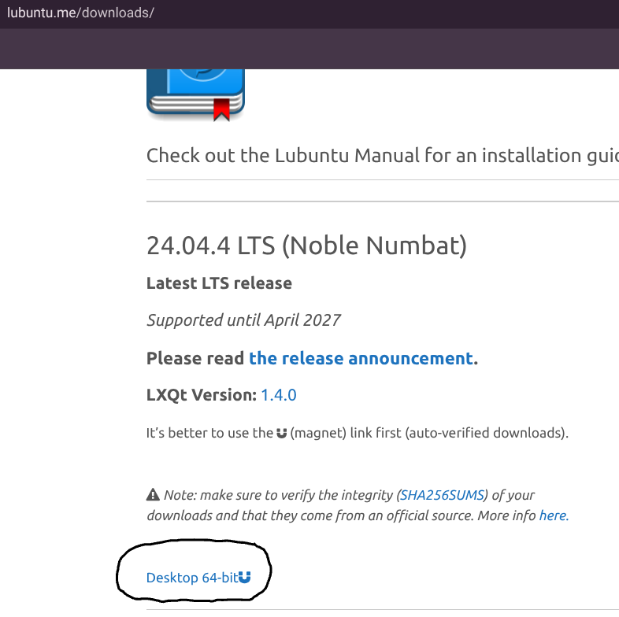

# Lubuntu Virtual Machine Deployment via QEMU (ChromeOS Environment)

## 📌 Overview
This project began as a practical need for a lightweight, controlled Linux development environment on a Chromebook. Initial attempts included evaluating Windows and alternative lightweight operating systems, but installation size, compatibility issues, and virtualization constraints led to performance limitations within the ChromeOS container environment.

To solve this, I engineered a Lubuntu-based virtual machine using QEMU system emulation. Due to the absence of hardware KVM acceleration in Crostini, the system was configured using multi-threaded TCG software emulation with manual resource tuning and boot configuration.

The result is a stable, optimized within constraints, virtual machine deployment designed for personal development workflows and experimentation with low-level system configuration.

## 🎯 Objectives

- Establish a lightweight, reliable development environment within ChromeOS
- Evaluate operating system options based on size, compatibility, and performance
- Deploy a stable virtual machine without hardware KVM acceleration
- Manually configure CPU, memory, and boot parameters for optimal performance
- Automate VM startup to streamline daily workflow

---

## 🔄 Evaluation & Decision Process

### 1. Operating System Selection

Initial consideration included installing Windows for broader software compatibility. However, Windows image size, resource overhead, and performance limitations within a containerized environment made it inefficient for the intended workflow.

Lightweight Linux distributions were then used to reduce system strain while maintaining flexibility.

### 2. Virtualization Constraints

ChromeOS (Crostini) does not expose hardware KVM acceleration since the software was removed from ChromeOS in 2018, requiring full software-based emulation via QEMU’s Tiny Code Generator (TCG). This introduced performance overhead that required careful tuning.

### 3. Final Decision

Selected Lubuntu due to its lightweight desktop environment and minimal system requirements. Implemented a manually configured QEMU deployment optimized for constrained virtualization.

---

## ⚠️ Performance Considerations

Because hardware KVM acceleration is not available in Crostini, the virtual machine operates under full software-based TCG emulation. Boot times are significantly longer than hardware-accelerated virtualization; however, the configuration prioritizes functional stability and controlled resource usage over raw performance.

---

## 🛠 Technologies Used

- QEMU (x86_64 full system emulation)
- QCOW2 disk image format
- Lubuntu Linux distribution
- Bash scripting
- Linux CLI (Crostini environment)
- CPU throttling via `cpulimit`

---

## ⚙️ System Configuration

The virtual machine was configured manually using QEMU parameters:

- Memory Allocation: 1536 MB
- CPU Cores: 2
- CPU Flags: `-cpu max,+nx`
- Acceleration: `-accel tcg,thread=multi`
- Disk Image: QCOW2 format
- Display Backend: SDL (`gl=off` to prevent rendering conflicts)
- USB Tablet Device: Enabled for accurate pointer mapping
- CPU Throttling: Applied to protect host system responsiveness

---

## 🚀 Launch Script

🚀 Launch Script

To eliminate repetitive manual commands, the VM is encapsulated into an executable Bash script.

```bash
cpulimit -l 95 -- qemu-system-x86_64 \
-m 1536 \
-smp 2 \
-cpu max,+nx \
-vga std \
-display sdl,gl=off \
-full-screen \
-accel tcg,thread=multi \
-usb -device usb-tablet \
-hda lubuntu.qcow2 \
-boot c \
-no-reboot \
-no-shutdown \
-rtc base=localtime,clock=host
```

## Lubuntu VM Disk Image

The VM disk image (`lubuntu.qcow2`) is **not included** in this repository due to its large size (~13.86 GB). The ("Lunbuntu.iso") is **not included** in this repository due to its large size (~3.46 GB).

## To use the launch script:

## Lubuntu ISO / QCOW2 Image

To run the VM, you need a Lubuntu disk image.

1. Download the official Lubuntu ISO from the website:  
   [Lubuntu ISO Downloads](https://lubuntu.me/downloads/)



2. Must, convert it to a QCOW2 image for use with QEMU.

## 🖥 QEMU Requirement

This project uses QEMU for running the Lubuntu VM. You need to install it on your system before using the launch script.

### Installation

**Linux (Debian/Ubuntu):**
```bash
sudo apt update
sudo apt install qemu qemu-kvm qemu-utils
```
   

## Run the following command to create a QCOW2 image (example: 20 GB):

```bash
qemu-img create -f qcow2 lubuntu.qcow2 20G
```
3. Open a terminal and navigate to the folder containing the ISO.

4.Place the QCOW2 file in the **same folder as `launch.sh`**.
5. Run the launch script as described in the README.


